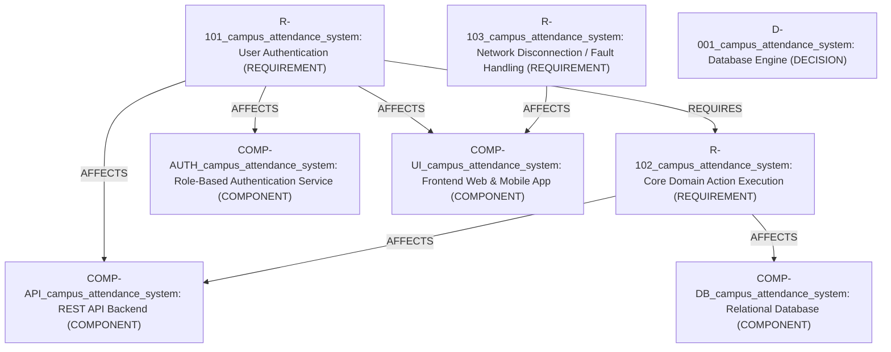

# Campus Attendance System — Project Specification
> **Domain:** COLLEGE_STUDENT | **Source:** idea | **Health Score:** 63.25000000000001% (Entropy: 0.44)

## 1. Executive Summary & Objective
Initial project initialization for Campus Attendance System

## 2. Specification Health & Entropy Status
- **Entropy Rating:** 0.437 / 1.0
- **Spec Health Score:** 63.25000000000001%
- **Open Unknowns:** 3
- **Active Conflicts:** 0

### Recommendations:
- Resolve 1 high-impact Unknown(s) in questioning.
- Review and approve proposed requirements.
- Sign off on 1 unapproved/proposed architectural decision(s).

## 3. Requirements (EARS Syntax)

### `R-101_campus_attendance_system`: User Authentication
- **Statement (EARS - UBIQUITOUS):** `the System shall authenticate registered users using secure credentials before granting access to workflows.`
- **Priority:** CRITICAL | **Status:** PROPOSED | **Confidence:** 0.95
- **Affected Components:** Frontend Web & Mobile App, REST API Backend, Role-Based Authentication Service
- **Acceptance Criteria:**
  - [ ] Valid credentials successfully generate access tokens
  - [ ] Invalid credentials reject with HTTP 401 Unauthorized

### `R-102_campus_attendance_system`: Core Domain Action Execution
- **Statement (EARS - EVENT_DRIVEN):** `WHEN an authorized user submits a record or action request, the System shall record and store the operational log with UTC timestamp and actor identity.`
- **Priority:** HIGH | **Status:** PROPOSED | **Confidence:** 0.9
- **Affected Components:** REST API Backend, Relational Database
- **Acceptance Criteria:**
  - [ ] Submitted actions are committed with immutable audit timestamp
  - [ ] Unauthorized submissions return HTTP 403 Forbidden

### `R-103_campus_attendance_system`: Network Disconnection / Fault Handling
- **Statement (EARS - UNWANTED_BEHAVIOR):** `IF the network connection is lost during data submission, THEN the System shall queue pending local transactions and display a non-blocking offline alert.`
- **Priority:** MEDIUM | **Status:** PROPOSED | **Confidence:** 0.85
- **Affected Components:** Frontend Web & Mobile App
- **Acceptance Criteria:**
  - [ ] Network interruption triggers offline queueing
  - [ ] Reconnection synchronizes queued records to the backend

## 4. Decision Ledger (with Preserved Disagreement)

### `D-001_campus_attendance_system`: Database Engine [PROPOSED]
- **Decision:** SQLite / PostgreSQL
- **Rationale:** ACID transactional safety for attendance and grade records
- **Governance:** Level: `USER` | Change Risk: `MEDIUM`
- **Preserved Disagreement (Rejected Alternatives):**
  - **MongoDB** (Proposed by: AI): *Lack of relational integrity for enrollment*

## 5. Architectural Components & Contracts

### Components:
- **`COMP-API_campus_attendance_system` (REST API Backend)**: BACKEND — *Status: PROPOSED*
- **`COMP-AUTH_campus_attendance_system` (Role-Based Authentication Service)**: AUTH — *Status: PROPOSED*
- **`COMP-DB_campus_attendance_system` (Relational Database)**: DATABASE — *Status: PROPOSED*
- **`COMP-UI_campus_attendance_system` (Frontend Web & Mobile App)**: FRONTEND — *Status: PROPOSED*

## 6. Dependency Graph (Mermaid)

## 7. Assumptions & Unknowns

### Assumptions:

### Open Unknowns:
- `[UNK-001_campus_attendance_system]` (Impact: HIGH, Category: ARCHITECTURE): **What is the deployment environment? (Local demo, university intranet, or public cloud)?** [Status: OPEN]
- `[UNK-002_campus_attendance_system]` (Impact: MEDIUM, Category: SECURITY): **What authentication method should be used? (Email/password, College SSO/SAML, or Roll Number/PIN)?** [Status: OPEN]
- `[UNK-003_campus_attendance_system]` (Impact: MEDIUM, Category: SECURITY): **Does attendance verification require QR codes, Geofencing, or Manual faculty entry?** [Status: OPEN]

## 8. Discovery Audit Log (Silent Assumptions)

- `[AUD-001_campus_attendance_system]` (LOW Risk): **Assumed:** Multi-tenancy across different universities is not required in MVP | *Reason Skipped:* Standard college project scope is single institution
- `[AUD-002_campus_attendance_system]` (LOW Risk): **Assumed:** English is the primary interface language | *Reason Skipped:* Default for college management software unless specified
